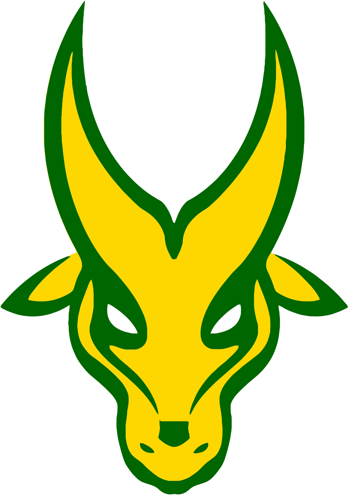

<a name="readme-top">

<br/>

<br />
<div align="center">
  <a href="https://github.com/zyx-0314/">
    
  </a>
  <h3 align="center">WD-Final-Project</h3>
</div>
<div align="center">
  Welcome to the repository for the Final Project in IT0043L.
</div>

<br />


---

<br />
<br />

<details>
  <summary>Table of Contents</summary>
  <ol>
    <li>
      <a href="#overview">Overview</a>
      <ol>
        <li>
          <a href="#key-components">Key Components</a>
        </li>
        <li>
          <a href="#technology">Technology</a>
        </li>
      </ol>
    </li>
    <li>
      <a href="#rule,-practices-and-principles">Rules, Practices and Principles</a>
    </li>
    <li>
      <a href="#resources">Resources</a>
    </li>
  </ol>
</details>

---

## Overview

Description of the project in details.

Guiding Question:
- This project was made in partial fulfillment of the requirements of IT0043/L. This project serves as the repository for the Final Project in said class.
- The purpose of the project is to showcase the stuent's skills in designing a multi-page website using VS Code as the IDE, and HTML, CSS, and JS as the languages.
- This wesbite consists of six(6) pages(Landing Page, About Page, Portfolio Page, Tips Page, Resources Page, and Contact Page).
- This website uses HTML, CSS, and JS to run its functions and display its elements.

### Key Components
- MultiPage Website

### Technology


## Rules, Practices and Principles
1. Always use `WD-` in the front of the Title of the Project for the Subject followed by your custom naming.
2. Do not rename any .html files; always use `index.html` as the filename.
3. Place Files in their respective folders.
4. All file naming are in camel case.
   - Camel case is naming format where there is no white space in separation of each words, the first word is in all lower case while the succeding words first letter are in upper followed by lower cased letters.
   - ex.: buttonAnimatedStyle.css
5. Use only `External CSS`.
6. Renaming of Pages folder names are a must, and relates to what it is doing or data it holding.
7. File Structure to follow below.

```
WD-ProjectName
└─ assets
|   └─ css
|   |   └─ style.css
|   └─ img
|   |   └─ fileWith.jpeg/.jpg/.webp/.png
|   └─ js
|       └─ script.js
└─ pages
|  └─ pageName
|     └─ assets
|     |  └─ css
|     |  |  └─ style.css
|     |  └─ img
|     |  |  └─ fileWith.jpeg/.jpg/.webp/.png
|     |  └─ js
|     |     └─ script.js
|     └─ index.html
└─ index.html
└─ readme.md
```

## Resources


| Title | Purpose | Link |
|-|-|-|
| Google Fonts | Source of fonts used. | https://fonts.google.com/?preview.layout=grid |
| CODEPEN.IO | Source for some animations used. | https://codepen.io/nelledejones/pen/gOOPWrK |
| Pinterest| Source of ideas for layout. | https://ph.pinterest.com/ |
| Vecteezy| Source of some PNG's used. | https://www.vecteezy.com/free-png/computer |
